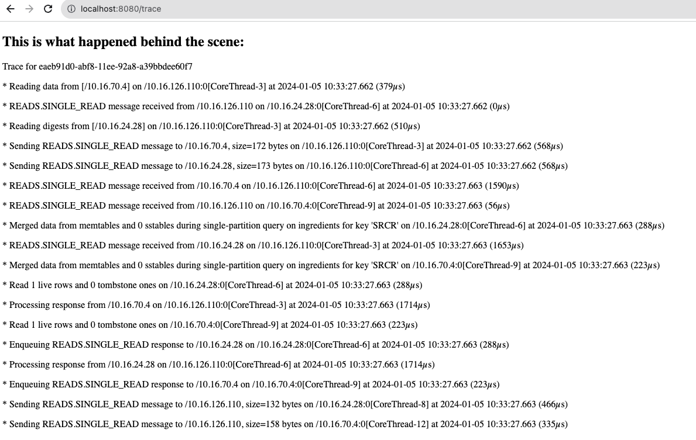

# Spring Boot Data Example of Using Query Trace in Astra DB
This is a web app to order tacos, demonstrating how to use query trace in Astra DB under Spring Boot framework, based on the [example code](https://github.com/habuma/spring-in-action-6-samples/tree/main/ch04/tacos-sd-cassandra) in the book Spring in Action.

The version for Cassandra is at the branch `cassandra`, [here](https://github.com/SiyaoIsHiding/spring-query-trace-example/tree/cassandra).

## Relevant Code
The following code sets the query tracing to true in `src/main/java/tacos/data/OrderRepositoryImpl.java`.
```java
    @Override
    public ResultSet saveWithQueryTrace(TacoOrder order) {
        BoundStatement statement = this.saveStatement
                .bind(order.getId(), order.getDeliveryName(), order.getDeliveryStreet(),
                        order.getDeliveryCity(), order.getDeliveryState(), order.getDeliveryZip(),
                        order.getCcNumber(), order.getCcExpiration(), order.getCcCVV(),
                        order.getPlacedAt(), order.getTacos())
                .setTracing(true);
        return session.execute(statement);
    }
```

And the following code retrieves the query trace information and present to the front end in `src/main/java/tacos/web/OrderController.java`.
```java
    ResultSet rs = orderRepo.saveWithQueryTrace(order);
    ExecutionInfo info = rs.getExecutionInfo();
    QueryTrace queryTrace = info.getQueryTrace();
    List<String> traceMessages = queryTrace.getEvents().stream().map(event ->
        String.format("* %s on %s[%s] at %s (%sµs)",
            event.getActivity(),
            event.getSourceAddress(),
            event.getThreadName(),
            new SimpleDateFormat("yyyy-MM-dd HH:mm:ss.SSS").format(new Date(event.getTimestamp())),
            event.getSourceElapsedMicros())).collect(java.util.stream.Collectors.toList());
    model.addAttribute("trace", traceMessages);
```

## Demo
### Prerequisite
This demo needs an Astra DB instance. Click [here](https://astra.datastax.com/) to register one for free, and create a keyspace called `taco_cloud` in it.

**Credentials**

You need to fill in the credentials at `src/main/resources/application.yml`:

```yml
spring:
  data:
    cassandra:
      keyspace-name: taco_cloud
      username: <client-id>
      Password: <client-secret>
      schema-action: create-if-not-exists
datastax.astra:
    secure-connect-bundle: <path-to-scb-from-src/main/resources/>
astra.db:
    id: <database-id>
    region: <database-region>
    keyspace: taco_cloud
    application.token: <application-token>
```
1. In your Astra DB dashboard overview page, grab the `database-id` and `database-region`.
2. Go to the "connect" tab, and then "Generate Token". From there you grab your `client-id`, `client-secret`, and `application-token`.
2. Click "Get Bundle" to download the secure connect bundle, and put it under `src/main/resources/`. Fill in the `<path-to-scb-from-src/main/resources/>`, which is a relevant path to `src/main/resources/`.

### Run the app
`mvn spring-boot:run` to run the app. Go to `localhost:8080`.


Build the taco


Place the order


See the trace

