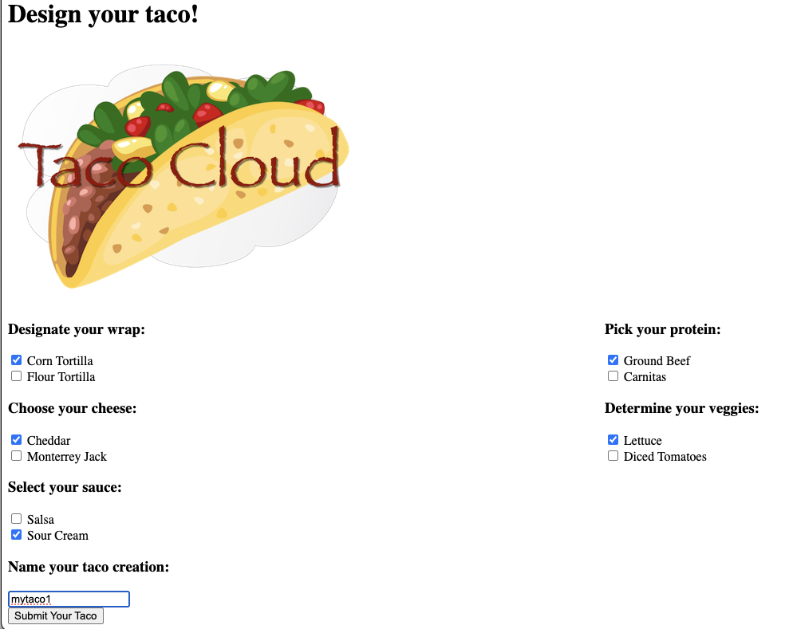
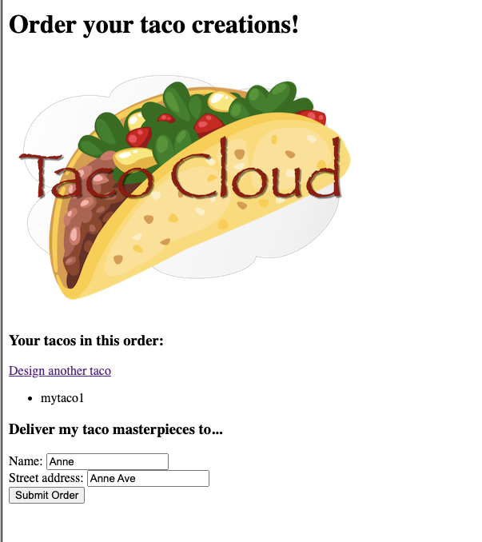

# Spring Boot Data Example of Using Query Trace in Cassandra
This is a web app to order tacos, demonstrating how to use query trace in Cassandra under Spring Boot framework, based on the [example code](https://github.com/habuma/spring-in-action-6-samples/tree/main/ch04/tacos-sd-cassandra) in the book Spring in Action.

The version for Astra DB is at the branch astra, [here](https://github.com/SiyaoIsHiding/spring-query-trace-example/tree/astra).

## Relevant Code
The following code sets the query tracing to true in `src/main/java/tacos/data/OrderRepositoryImpl.java`.
```java
    @Override
    public ResultSet saveWithQueryTrace(TacoOrder order) {
        BoundStatement statement = this.saveStatement
                .bind(order.getId(), order.getDeliveryName(), order.getDeliveryStreet(),
                        order.getDeliveryCity(), order.getDeliveryState(), order.getDeliveryZip(),
                        order.getCcNumber(), order.getCcExpiration(), order.getCcCVV(),
                        order.getPlacedAt(), order.getTacos())
                .setTracing(true);
        return session.execute(statement);
    }
```

And the following code retrieves the query trace information and present to the front end in `src/main/java/tacos/web/OrderController.java`.
```java
    ResultSet rs = orderRepo.saveWithQueryTrace(order);
    ExecutionInfo info = rs.getExecutionInfo();
    QueryTrace queryTrace = info.getQueryTrace();
    List<String> traceMessages = queryTrace.getEvents().stream().map(event ->
        String.format("* %s on %s[%s] at %s (%sµs)",
            event.getActivity(),
            event.getSourceAddress(),
            event.getThreadName(),
            new SimpleDateFormat("yyyy-MM-dd HH:mm:ss.SSS").format(new Date(event.getTimestamp())),
            event.getSourceElapsedMicros())).collect(java.util.stream.Collectors.toList());
    model.addAttribute("trace", traceMessages);
```

## Demo
### Prerequisite
This demo needs a local Cassandra instance running, with a keyspace called `taco_cloud` in it. You can use the following command to start a Cassandra instance in Docker.

```shell
# run cassandra in docker
docker network create cassandra-net
docker run --name my-cassandra \
  --network cassandra-net \
  -p 9042:9042 \
  -d cassandra:latest

# enter the cqlsh
docker run -it --network cassandra-net --rm cassandra cqlsh my-cassandra

# create the keyspace
cqlsh> create keyspace taco_cloud
 ... with replication={'class':'SimpleStrategy', 'replication_factor':1}
 ... and durable_writes=true;

# this piece of code comes from Spring in Action, 6th Edition.
```

If you have a Cassandra instance running somewhere else, you can change the configuration information in `src/main/java/tacos/CassandraConfig.java`.

You can also change the keyspace name in `src/resources/application.yml`.

### Run the app
`mvn spring-boot:run` to run the app. Go to `localhost:8080`.


Build the taco



Place the order



See the trace

